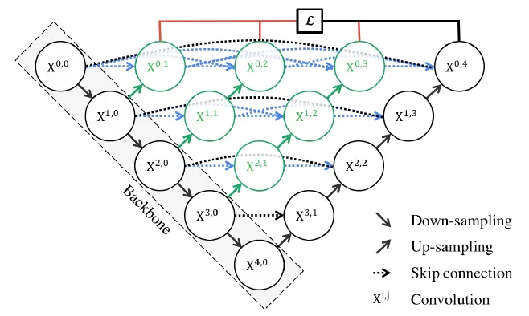

# Deep and Transfer Learning using ResNet-18 and U-Net++

## Description:

In this project, I used an **Ants and Bees dataset** to perform **transfer learning** making use of **ResNet-18** and **U-Net++** for **image classification** and **image segmentation** tasks. Through the use of **torchvision.transforms**, I applied different **image augmentation techniques** and normalized the images using their **mean** and **standard deviation** values. I defined a custom function, **def** `train_model()`, to streamline the model training process and to facilitate the usage of the **ResNet-18 architecture** for both **forward propagation** and **backpropagation**, as well as calculating and monitoring its  **loss function and accuracy**. The **classification accuracy** achieved with the **ResNet-18** model was **94%**.

### Using U-Net++ for Image Segmentation:

Currently, I am learning about the **U-Net++ architecture**—an evolution from the **U-Net**—which introduces **dense skip pathways** between the encoder and decoder blocks. These dense skip connections significantly improve **feature propagation**, enhance **gradient flow**, and allow for the capture of more **fine-grained details** in the segmentation output. Unlike U-Net, **U-Net++** creates a series of **nested skip connections** at each level, bridging the encoder and decoder at multiple levels. This design ensures that the decoder receives rich features from multiple encoder layers, helping to improve **localization accuracy** and **contextual information** during the image segmentation process.

